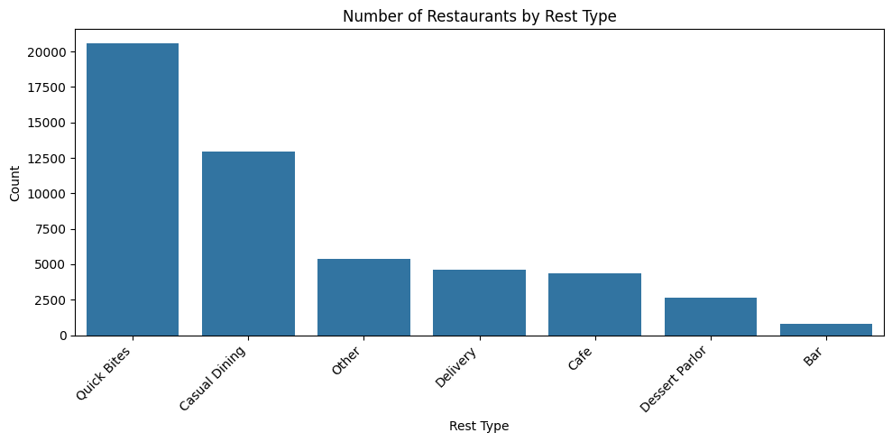
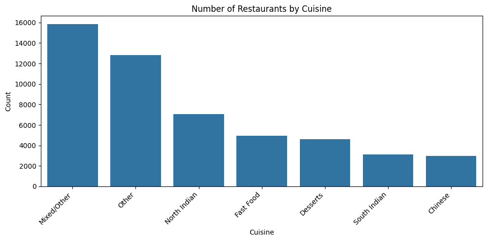

# Food-Analysis
Food Delivery Delay & Rating Analysis

Food delivery is now a big part of our daily lives, but there’s still a lot of issues with delays and inconsistent restaurant ratings. This analysis is important because it helps us understand what factors are really affecting delivery times and customer satisfaction. By digging into the data, we can spot patterns that might be missed otherwise, and maybe even help restaurants and delivery services improve their service. If you’ve ever wondered why your food sometimes takes too long or why some places have weirdly low ratings, this project is for your benifit.

## Dataset Description

For this project, I used the [Zomato Food Delivery Dataset](https://www.kaggle.com/datasets/bhanupratapbiswas/zomato/data) from Kaggle. This dataset contains information about restaurants, their ratings, delivery options, and more. Here’s a quick overview of the main columns:

- **name** *(object)*: Name of the restaurant.
- **online_order** *(int64)*: Whether online ordering is available (1 = Yes, 0 = No).
- **book_table** *(int64)*: Whether table booking is available (1 = Yes, 0 = No).
- **rate** *(float64)*: Average rating given by customers (ranges from 1.0 to 5.0, can be missing).
- **votes** *(int64)*: Number of votes/ratings received.
- **location** *(object)*: Area or locality of the restaurant.
- **rest_type** *(object)*: Type of restaurant (e.g., Quick Bites, Casual Dining, Cafe, etc.).
- **cuisines** *(object)*: Types of cuisines served (e.g., North Indian, Chinese, etc.).
- **approx_cost(for two people)** *(float64)*: Approximate cost for two people (in INR).
- **dish_liked** *(object)*: Popular dishes liked by customers.
- **phone** *(object)*: Contact number of the restaurant.
- **address** *(object)*: Full address of the restaurant.

### Missing Values

Here’s the number of missing values in each column (before cleaning):

- **name**: 16
- **online_order**: 19  
- **book_table**: 58  
- **rate**: 7838  
- **votes**: 78 
- **location**: 126 
- **rest_type**: 338  
- **cuisines**: 203  
- **approx_cost(for two people)**: 521  
- **dish_liked**: 28225
- **phone**: 1296
- **address**: 17

This dataset gives a pretty good snapshot of what’s happening in the food delivery scene, but as you can see, there are some missing values that need to be handled.

## Data Cleaning Steps

To make the analysis meaningful, I had to clean the data and handle missing or inconsistent values. Here’s what I did for each column and why:

- **name, phone, address:**  
  These columns had too many unique values and didn’t add much value to the analysis, so I dropped them to reduce noise.

- **online_order & book_table:**  
  Converted 'Yes'/'No' to 1/0 for easier analysis and filled missing values with the most common value (mode), since these are binary features.

- **rate:**  
  Removed the '/5' text, converted to numeric, and replaced missing values with the median rating. This helps keep the ratings consistent and avoids bias from outliers.

- **votes:**  
  Converted to numeric and filled missing values with the median, since vote counts can’t be negative and median is less affected by outliers.

- **location:**  
  Grouped rare locations as 'Other' and filled missing values with 'Unknown'. This helps focus on the most relevant areas and avoids too many categories.

- **rest_type:**  
  Standardized types (e.g., grouped all types containing 'cafe' as 'Cafe'), and filled missing values with 'Unknown'. This reduces redundancy and makes analysis easier.

- **cuisines:**  
  Categorized into main cuisine groups (like North Indian, Chinese, etc.), and grouped mixed or rare cuisines as 'Mixed/Other' or 'Other'. This helps in segmenting the data for better insights.

- **approx_cost(for two people):**  
  Removed commas, converted to numeric, and filled missing values with the median cost. This ensures cost data is usable for analysis.

- **dish_liked:**  
  Standardized dish names, grouped the most common dishes, and labeled the rest as 'Other' or 'Many Dishes'. This reduces redundancy and highlights popular choices.

By cleaning the data this way, I made sure the dataset is consistent, easier to analyze, and more useful for finding real

## Exploratory Data Analysis (EDA)

To understand the data better and find useful patterns, I used several visualizations with Seaborn. Here’s what I explored and why each graph is important:

### 1. Distribution of Restaurant Ratings

**Reasoning:**  
This shows how ratings are spread out. It helps to see if most restaurants are rated high, low, or somewhere in between.

---

### 2. Votes vs. Rating

**Reasoning:**  
This plot checks if restaurants with more votes tend to have higher or lower ratings, showing if popularity affects ratings.

---

### 3. Average Cost by Location (Top 10)

**Reasoning:**  
Helps to compare how much it costs to eat out in different areas, and spot expensive or affordable zones.

---

### 4. Number of Restaurants by Rest Type

**Reasoning:**  
Shows which types of restaurants are most common, like cafes, quick bites, or casual dining.

---

### 5. Number of Restaurants by Cuisine

**Reasoning:**  
Reveals the most popular cuisines in the dataset, helping to understand food trends.

---

### 6. Rating Distribution by Online Order Availability

**Reasoning:**  
Compares ratings between restaurants that offer online ordering and those that don’t, to see if online order affects customer satisfaction.

---

### 7. Rating Distribution by Table Booking Availability

**Reasoning:**  
Checks if restaurants with table booking options get better ratings.

---

### 8. Correlation Heatmap of Numeric Features

**Reasoning:**  
Shows how numeric features like rating, votes, and cost are related to each other.
<!-- **Insights:**  
Looking at this heatmap, I noticed that some features are more connected than others. For example, there’s a pretty strong relationship between the number of votes and the rating a restaurant gets, which kind of makes sense because popular places usually get more attention and feedback. On the other hand, the cost for two people doesn’t really have a strong link with ratings, so just because a place is expensive doesn’t mean it’s rated higher. This helped me figure out which columns might actually matter if I want to predict ratings or understand what makes customers happy. Also, if two features are super correlated, I’d probably just use one of them in any model to keep things simple and avoid confusion. -->
---

### 9. Average Rating by Restaurant Type

**Reasoning:**  
Helps to spot which restaurant types tend to have lower or higher ratings.

---

### 10. Average Rating by Location (Top 10)

**Reasoning:**  
Shows which areas have the best or worst rated restaurants.

---

These EDA steps helped me find patterns and relationships in the data, making it easier to understand what affects restaurant and ratings.

## Conclusion & Key Insights

After exploring and analyzing the data, I found a few interesting things that really stood out:

- **Popular restaurants get more ratings:** There’s a clear link between the number of votes and higher ratings, which means places that are already popular tend to get even more attention and feedback.
- **Cost doesn’t guarantee quality:** Just because a restaurant is expensive doesn’t mean it’s rated higher. People care about more than just price when leaving reviews.
- **Restaurant type matters:** Some types, like casual dining or cafes, tend to get better ratings than others. Quick bites and delivery-only places sometimes have lower ratings, maybe because of speed or food quality.
- **Location has an impact:** Certain areas have more highly rated restaurants, while others lag behind. This could be due to competition, customer expectations, or just the kind of crowd that visits.
- **Online order and table booking:** Restaurants that offer online ordering or table booking don’t always get better ratings, but it does seem to help in some cases, probably because it’s more convenient for customers.
- **Cuisines and food trends:** North Indian and Chinese are super popular, but mixed or unique cuisines don’t always get the same love.

Overall, cleaning the data and visualizing it made it way easier to spot these patterns. If someone wants to open a new restaurant or improve their ratings, focusing on customer experience, being in the right location, and not just pricing high could really help. And for delivery services, understanding these trends can help them work better with restaurants to keep customers